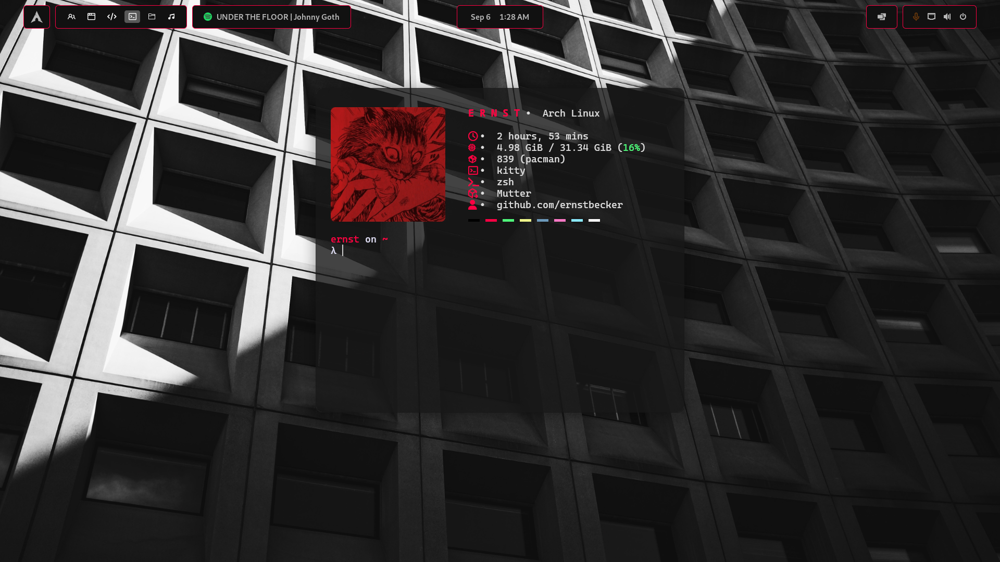
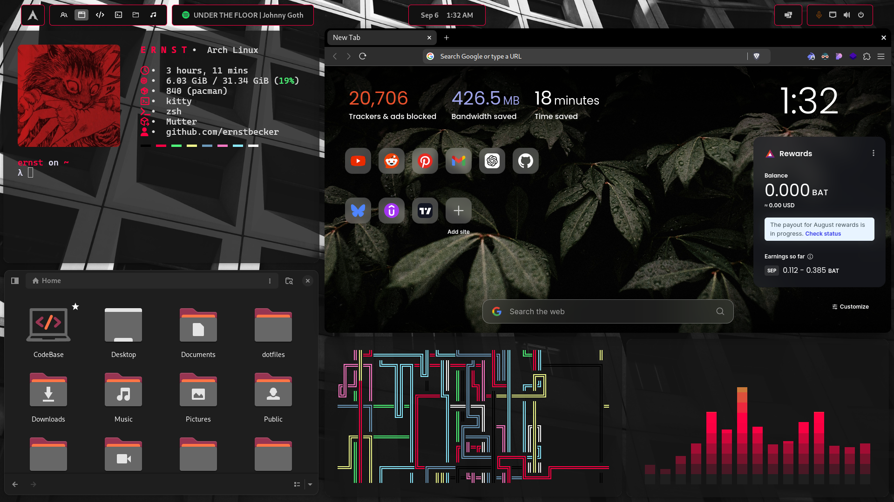
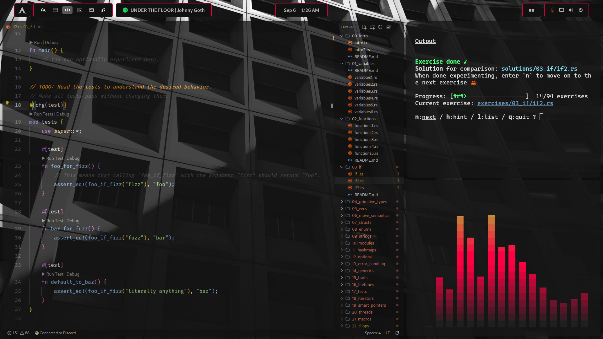

<div align="center">
  <h1>💎 Ernst's dotfiles 💎</h1>
  <h3>🚧  Work in Progress  🚧</h3>
</div>

<p align="center">
  
  
  
</p>

<div align="center">
  <a href="#-about">About</a>&nbsp;&nbsp;&nbsp;|&nbsp;&nbsp;&nbsp;
  <a href="#-screenshots">Screenshots</a>&nbsp;&nbsp;&nbsp;|&nbsp;&nbsp;&nbsp;
  <a href="#-extensions">Extensions</a>&nbsp;&nbsp;&nbsp;|&nbsp;&nbsp;&nbsp;
  <a href="#-themes">Themes</a>&nbsp;&nbsp;&nbsp;|&nbsp;&nbsp;&nbsp;
  <a href="#-installation">Installation</a>
</div>

## 🏮 About

> [!WARNING]
> Don’t blindly use my settings unless you understand what they entail. Use at your own risk!

These are the configuration files I use in my daily life. I hope they can help you as well.

Programs' configuration files that you will find in this repository:
- Kitty & Alacritty
- Zsh ([ohmyposh](https://github.com/JanDeDobbeleer/oh-my-posh), [autosuggestions](https://github.com/zsh-users/zsh-autosuggestions), [highlighting](https://github.com/zsh-users/zsh-syntax-highlighting) and history)
- Fastfetch & Neofetch
- MPV
- Lvim
- Rofi

## 📸 Screenshots
**⚠️ Illustrative images do not represent the final result! ⚠️**

<div align="center">
  
  <br><br>
  
  <br><br>
  
</div>

## Extensions
Install using gnome extensions:
- [Blur my Shell](https://extensions.gnome.org/extension/3193/blur-my-shell/)
- [Default Workspace](https://extensions.gnome.org/extension/4783/default-workspace/)
- [Logo Menu](https://extensions.gnome.org/extension/4451/logo-menu/)
- [Media Label and Controls (Mpris Label)](https://extensions.gnome.org/extension/4928/mpris-label/)
- [Quick Settings Audio Devices Hider](https://extensions.gnome.org/extension/5964/quick-settings-audio-devices-hider/)
- [Space Bar](https://extensions.gnome.org/extension/5090/space-bar/)
- [Steal my focus window](https://extensions.gnome.org/extension/6385/steal-my-focus-window/)
- [Auto Move Windows](https://extensions.gnome.org/extension/16/auto-move-windows/)
- [User Themes](https://extensions.gnome.org/extension/19/user-themes/)
Install manually:
- [Rounded Window Corners](https://github.com/yilozt/rounded-window-corners)
- [Pop Shell](https://github.com/pop-os/shell)
Click [here](Infos/extensions.md) to see how to configure the extensions.

## 🎨 Themes
| Program | Theme |
| --- | --- |
| Kitty | BeckerTheme |
| Gnome-Shell | BeckerTheme |
| Icons | [Papirus-Dark](https://github.com/PapirusDevelopmentTeam/papirus-icon-theme) |
| Folders | [Papirus-Yaru](https://github.com/PapirusDevelopmentTeam/papirus-folders) |
| Cursor | [Colloid-Cursors](https://github.com/vinceliuice/Colloid-icon-theme/tree/main/cursors) |

## 💾 Installation
### Dependencies
For the installation of programs dependencies (fonts, themes, programs, etc.). You can run the script.

```bash
chmod +x Scripts/install.zsh
zsh Scripts/install.zsh
```

### Dotfiles
If you need help with the stow command, you can read [here](https://www.gnu.org/software/stow/manual/stow.html).

```bash
stow .
```
