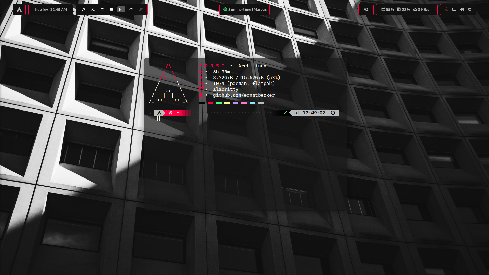
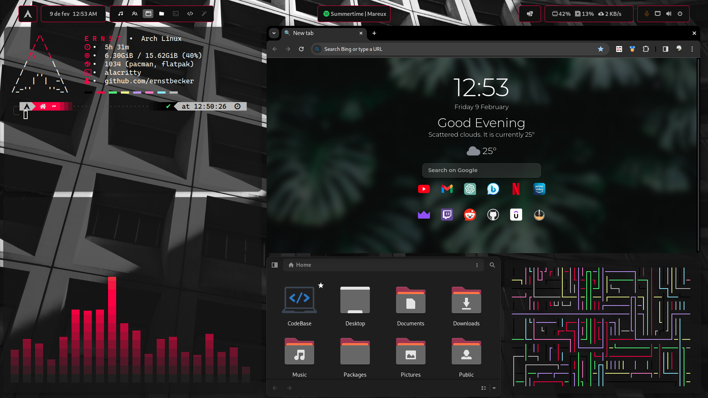
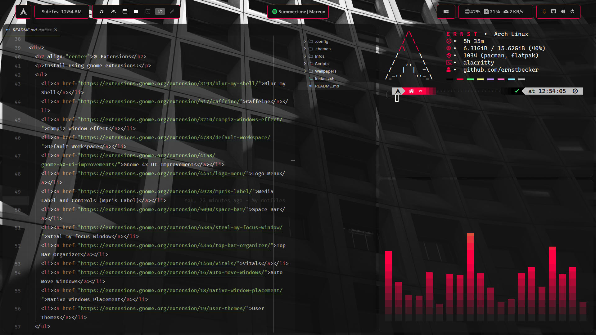

  <h1>🛑 Ernst's dotfiles</h1>

  <a href="#-screenshots">Screenshots</a>&nbsp;&nbsp;&nbsp;|&nbsp;&nbsp;&nbsp;
  <a href="#-extensions">Extensions</a>&nbsp;&nbsp;&nbsp;|&nbsp;&nbsp;&nbsp;
  <a href="#-themes">Themes</a>&nbsp;&nbsp;&nbsp;|&nbsp;&nbsp;&nbsp;
  <a href="#-installation">Installation</a>

  <h2 >🚧  Work in Progress  🚧</h2>

  
<b>⚠️Warning⚠️</b>: Don’t blindly use my settings unless you know what that entails. Use at your own risk!

  
Configuration files for:

    <ul>
      <li>Alacritty
      <li>Zsh (<a href="https://github.com/romkatv/powerlevel10k">p10k</a>, <a href="https://github.com/zsh-users/zsh-autosuggestions">autosuggestions</a>, <a href="https://github.com/zsh-users/zsh-syntax-highlighting">highlighting</a> and history)
      <li>Lvim
      <li>Neofetch
      <li>Rofi
      <li>VLC
    </ul>

  <h2>📸 Screenshots</h2>
  
<b>⚠️Illustrative images do not represent the final result!⚠️</b>

  

    
      
    
      
    
  

  <h2 align="center">⚙ Extensions</h2>
  
Install using gnome extensions:

  <ul>
    <li><a href="https://extensions.gnome.org/extension/3193/blur-my-shell/">Blur my Shell</a></li>
    <li><a href="https://extensions.gnome.org/extension/517/caffeine/">Caffeine</a></li>
    <li><a href="https://extensions.gnome.org/extension/3210/compiz-windows-effect/">Compiz window effect</a></li>
    <li><a href="https://extensions.gnome.org/extension/4783/default-workspace/">Default Workspace</a></li>
    <li><a href="https://extensions.gnome.org/extension/4158/gnome-40-ui-improvements/">Gnome 4x UI Improvements</a></li>
    <li><a href="https://extensions.gnome.org/extension/4451/logo-menu/">Logo Menu</a></li>
    <li><a href="https://extensions.gnome.org/extension/4928/mpris-label/">Media Label and Controls (Mpris Label)</a></li>
    <li><a href="https://extensions.gnome.org/extension/5090/space-bar/">Space Bar</a></li>
    <li><a href="https://extensions.gnome.org/extension/6385/steal-my-focus-window/">Steal my focus window</a></li>
    <li><a href="https://extensions.gnome.org/extension/4356/top-bar-organizer/">Top Bar Organizer</a></li>
    <li><a href="https://extensions.gnome.org/extension/1460/vitals/">Vitals</a></li>
    <li><a href="https://extensions.gnome.org/extension/16/auto-move-windows/">Auto Move Windows</a></li>
    <li><a href="https://extensions.gnome.org/extension/18/native-window-placement/">Native Windows Placement</a></li>
    <li><a href="https://extensions.gnome.org/extension/19/user-themes/">User Themes</a></li>
  </ul>
  
Install manually:

  <ul>
    <li><a href="https://github.com/yilozt/rounded-window-corners">Rounded Window Corners</a></li>
    <li><a href="https://github.com/pop-os/shell">Pop Shell</a></li>
    <li><a href="https://github.com/hardpixel/unite-shell">Unite</a></li>
  </ul>
  
Click <a href="Infos/extensions.md">here</a> to see how to configure the extensions.

  <h2>🎨 Themes</h2>
  
<b>Shell</b>: BeckerTheme (Modded version of catppuccin)

  
<b>Icons</b>: <a href="https://store.kde.org/p/1166289/">Papirus-Dark</a>

  
<b>Folders</b>: <a href="https://github.com/PapirusDevelopmentTeam/papirus-folders">Papirus-Yaru</a>

  
<b>Cursor</b>: <a href="https://www.gnome-look.org/p/1652458">ArcDusk Cursors</a> and <a href="https://www.gnome-look.org/p/1831077">Culloid-Cursors</a>

  
<b>Alacritty</b>: BeckerTheme

  <h2 align="center">💾 Installation</h2>

  <h3>Dependencies</h3>
  
To install the programs I use.

  <pre><code>yay -S zsh alacritty neofetch rofi cava</code></pre>
  
First you will need to install the dependencies.

  <pre><code>sudo pacman -S exa bat</code></pre>

  <h3>Fonts and Themes</h3>
  
For install necessary fonts and themes.

  <pre><code>chmod -x fontsthemes.zsh</code><code>zsh fontsthemes.zsh</code></pre>

  <h3>Dotfiles</h3>
  
To apply the dotfiles, run the zsh script.

  <pre><code>chmod -x install.zsh</code><code>zsh install.zsh</code></pre>

